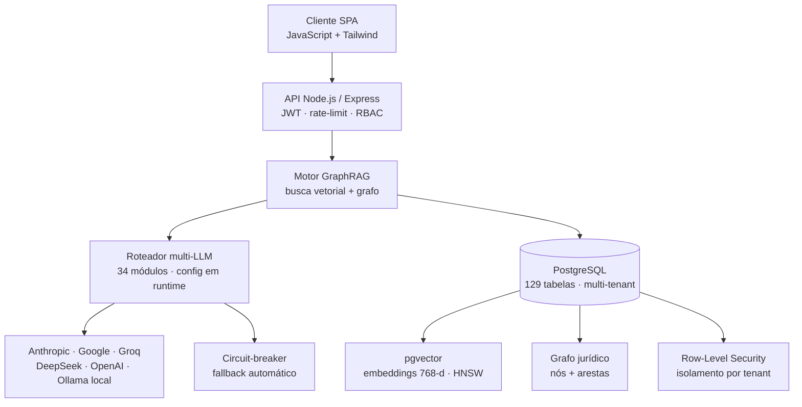

# Grafo

> Plataforma SaaS multi-tenant para EdTech, com motor de IA próprio: **GraphRAG** + uma camada de **orquestração multi-LLM** (6 provedores integrados, **34 módulos** roteáveis em runtime, com fallback automático), construída **sem frameworks**. Em produção num preparatório jurídico.

**Stack:** Node.js · Express · PostgreSQL + pgvector (HNSW) · Grafo de conhecimento · Orquestração multi-LLM (Anthropic · Google · Groq · DeepSeek · OpenAI · Ollama) · Docker · Nginx · VPS Linux

---

## O problema

Num preparatório, a dúvida de conteúdo de um aluno só era respondida quando havia um humano disponível — professor, monitor ou coordenação — dentro do horário e da fila de atendimento. O aluno esperava de **horas a dias** por uma resposta que dependia inteiramente de alguém estar livre.

O Grafo resolve isso com um **tutor de IA ancorado no acervo do próprio curso** (não na internet): responde de forma socrática, citando a teoria e as questões internas, com resposta em **minutos, 24/7**. Se a base não contém o que sustenta a resposta, o sistema **não inventa** — encaminha para curadoria humana.

Esse é o caso de uso principal, mas o mesmo motor alimenta outras automações operacionais: transformação de lei seca em material didático estruturado e auditoria de comissões de vendas com regras hierárquicas e saída auditável.

---

## Arquitetura

A recuperação faz, **numa única query SQL**, a fusão de busca vetorial (pgvector/HNSW), travessia de aresta no grafo de conhecimento e filtro por metadado — sem sincronizar dois sistemas, com consistência transacional.

---

## Decisões de arquitetura

Estas são as escolhas que definem o projeto. Cada uma foi tomada conscientemente, com trade-offs entendidos.

### Por que orquestração própria, sem LangChain

A qualidade da recuperação e o controle anti-alucinação **são o produto**. Uma camada de abstração de framework esconde exatamente o passo que eu preciso dominar: como fundir vetor + grafo, montar o contexto e ancorar a resposta na base.

Optei por orquestração própria — só SDKs oficiais + Postgres. Zero camada mágica, zero churn de versão de framework, controle total sobre prompt e custo. Quando algo quebra, eu sei onde e por quê.

### A camada de orquestração multi-LLM (o coração do sistema)

O motor não está acoplado a um modelo nem a um fornecedor. Há uma **camada de roteamento própria** que decide, por funcionalidade, qual provedor e modelo atende a requisição — e isso é **configuração em runtime, não código**. Um gestor troca o modelo de qualquer módulo pelo painel, em tempo real, **sem deploy**.

- **6 provedores integrados** (Anthropic, Google, Groq, DeepSeek, OpenAI, Ollama-local) — **4 em roteamento ativo hoje** — mais um caminho de *billing* de custo fixo para cargas interativas (ver FinOps abaixo).
- **34 módulos** configurados, cada um com provedor / modelo / temperatura / max-tokens próprios.
- **Circuit-breaker**: cota estourada ou falha num provedor **comuta automaticamente** para um fallback equivalente (ex.: Google → Anthropic Haiku; Groq → Gemini Flash), sem intervenção. Há ainda um **modo local** (Ollama) que tenta primeiro e cai para a nuvem se indisponível.

A lógica de atribuição segue o ponto ótimo de cada modelo:

| Tarefa | Modelo típico | Por quê |
|---|---|---|
| Embeddings (768-d) | Gemini | Custo baixo em altíssimo volume |
| Geração didática longa (material, lei) | Claude Sonnet / Opus | Aderência à instrução, output longo sem truncar |
| Parse e classificação em lote | Claude Haiku | Saída estruturada, barata e rápida |
| Extração de JSON / fallback barato | Gemini Flash · Groq · DeepSeek | Throughput por centavo |
| Multimodal (OCR de redação, leitura de cartão) | Gemini | Exige provedor com visão |

Resultado: agnóstico de fornecedor, sem lock-in, resiliente a falha de provedor, com custo e qualidade afináveis por tarefa — tudo sem tocar no código.

### FinOps: desacoplar a escolha de modelo da estrutura de billing

Conteúdo de concurso é denso e exige os melhores modelos, o que queima tokens em volume — caro até para iterar. Em vez de aceitar qualidade pior para caber no orçamento, separei **duas decisões que normalmente vêm coladas**: *qual modelo usar* e *como esse modelo é cobrado*.

Para o uso interativo pesado (tutoria do aluno, geração de material), o roteamento prioriza um **tier de billing de custo fixo** quando disponível, em vez da API por token — então uso intenso deixa de escalar custo linearmente. Uma **fila assíncrona** faz o *pacing* do consumo, e há **fallback automático para a API por token** em caso de indisponibilidade — economia sem sacrificar confiabilidade.

A estratégia geral de custo é deliberada:

| Camada | Operações | Custo |
|---|---|---|
| Alto volume | Embeddings, parse de questões, busca vetorial, cache de explicações | Baixo (free tier + SQL puro) |
| Alto valor | Geração de material didático, sistematização de lei | Justificado (modelo premium) |

### Por que pgvector dentro do Postgres (não Pinecone/Qdrant)

Os vetores moram **ao lado** do dado relacional (questões, materiais) e do grafo de conhecimento. Isso permite que a recuperação faça JOIN de vetor + aresta de grafo + metadado numa query só — sem sincronizar dois sistemas, sem infra/custo extra, com consistência transacional.

O índice HNSW dá a velocidade de busca aproximada; manter tudo no Postgres deixa a fusão vetor↔grafo numa única superfície SQL. **Um banco, um backup, uma fonte de verdade.**

---

## Números (verificados em produção)

| Métrica | Valor |
|---|---|
| Acervo vetorizado | 15.607 trechos · 100% com embedding · 768-d · HNSW/cosseno |
| Banco de questões | 1.318 questões ativas, pesquisáveis pela IA |
| Schema | 129 tabelas · ~25 serviços de domínio |
| Orquestração de IA | 6 provedores integrados (4 ativos) · 34 módulos configuráveis em runtime, sem deploy |
| Grafo de conhecimento | Nós (lei/artigo/súmula/princípio) + arestas (fundamenta/revoga/aplica) extraídos na ingestão |

**GraphRAG, não só RAG:** na ingestão, cada chunk passa por extração de entidades e relações que populam um grafo jurídico paralelo aos vetores. Na consulta, o sistema encontra os vetores mais próximos, puxa os nós ligados e seus vizinhos de grau 1, e anexa esse mapa de relações ao prompt — dando ao modelo a estrutura normativa em torno do tema, não só trechos soltos.

**Anti-alucinação ("cite-or-die"):** a resposta é ancorada no acervo. Se a base não sustenta a resposta, o sistema encaminha para curadoria humana em vez de inventar.

**Multi-tenancy (em validação):** modelo Pool com Row-Level Security + particionamento HASH das tabelas mais quentes por tenant — testado em ambiente isolado antes de tocar produção.

> **Benchmark planejado:** latência de query (antes→depois da otimização de índice) e precisão de recuperação serão medidos e publicados aqui.

---

## Segurança & operação

- **Isolamento multi-tenant** via Row-Level Security no Postgres (em validação)
- **Autenticação** JWT, rate-limiting, RBAC
- **Hardening** de segurança (correções de classe OWASP)
- **Deploy** em container Docker atrás de Nginx, em VPS Linux
- **Backups** automatizados, com cópia off-site

---

## Sobre este repositório

Este é um **repositório-vitrine**: documenta a arquitetura e as decisões técnicas do Grafo, um produto proprietário em operação. O código-fonte do motor (algoritmo de fusão vetor↔grafo, prompts, lógica de negócio) **não é publicado**. O objetivo aqui é demonstrar *como o sistema foi pensado*, não distribuí-lo.

**Lucas Epifanio Lopes** — Desenvolvedor Full-Stack
**Contato:** [lucas@grafoedtech.com](mailto:lucas@grafoedtech.com) · [LinkedIn](https://www.linkedin.com/in/lucas-epifanio-lopes-a005503b6) · [grafoedtech.com](https://grafoedtech.com)
